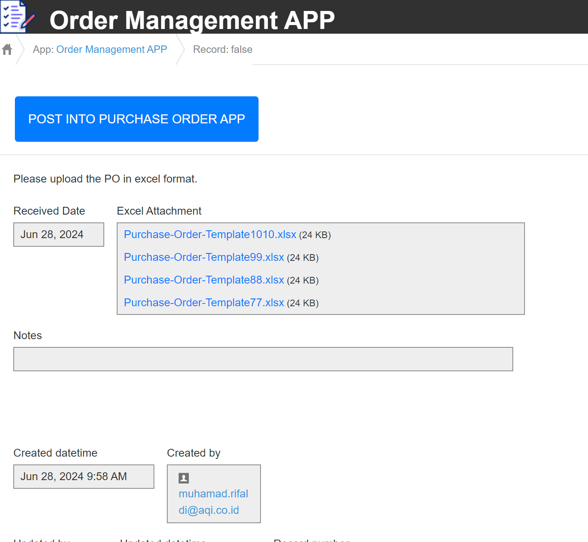
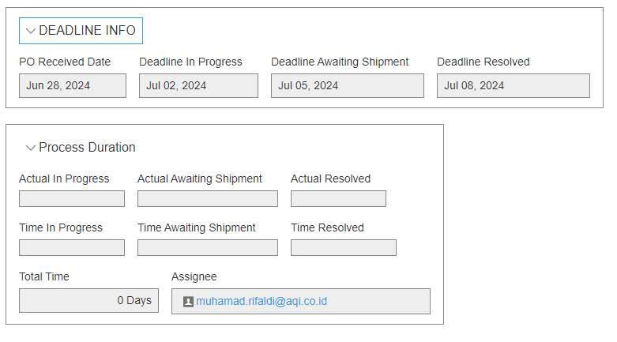

# Customer Order Management System With Kintone Document

**Title**: Customer Order Management System With Kintone

**Revision History**:

- Version 0.1 - Initial draft by Muhamad Rifaldi on 12-06-2024.
- Version 0.2 - New Process Management by Muhamad Rifaldi on 20-06-2024.
- Version 0.5 - Revamp the whole auto recommend assignee, add validation to excel files on 27-06-2024
- Version 1.0 - Demo Version by Muhamad Rifaldi on 28-06-2024.

---

## Introduction

**Purpose**:
This document outlines the specifications for a Customer Order Management System designed to convert Excel files into purchase order records and efficiently manage the workflow of these orders.

**Scope**:
This document encompasses the requirements for converting customer order Excel spreadsheets into purchase order records within Kintone, updating purchase order statuses, implementing intelligent auto-recommend assignee based on expertise and workload, automatically calculating process date deadlines, displaying performance measurement charts, and ensuring timely completion with deadline reminder notifications.

---

## Overall Description

**Product Perspective**:
The Customer Order Management System consists of the Order Management App, Purchase Order App, and Purchasing Department App. These apps are integrated to streamline the entire order processing workflow.

**Product Functions**:

- Convert and read customer order Excel spreadsheets into purchase order records.
- Update purchase order statuses with intelligent assignee recommendation based on workload and expertise.
- Automatically calculate each process deadline, intelligently excluding weekends.
- Send reminders for approaching deadlines to assignees.

**User Characteristics**:

- Kintone users, employees, or salespersons with access to the Order Management App.
- Members of the purchasing department with access to the Purchase Order App.

**Assumptions and Dependencies**:

- Excel files follow a specific order format.
- Each customer order has a unique PO number and cannot be duplicated.
- Users have the necessary permissions in Kintone.

---

## Specific Requirements

**Functional Requirements**:

1. **Convert Customer Order Excel Files to Purchase Order Records**:

   - Multiple Excel attachments can be uploaded.
   - Each attachment generates a new record in the Purchase Order App when the upload button is pressed on the detail page.
   - Fields in the Purchase Order App are populated based on the Excel data.
   - Validation ensures attachments are in the predetermined format and do not duplicate existing PO numbers.

2. **Intelligently Recommend Assignee**:

   - Button to assign tasks to the purchasing department member with the least workload and highest expertise.
   - Based on data from the Purchasing Department App.
   - Users can manually override the auto-assignment by selecting from a dropdown list.

3. **Update Purchase Order Status & Auto Calculate Deadline Dates**:

   - Status changes to "PO Received" when the custom assign button is pressed.
   - Automatically calculate deadline dates excluding weekends.
   - PO Received (creation date), In Progress (2 days), Awaiting Shipment (3 days), Resolved (1 day).
   - Update dates and days spent between processes as they advance.
   - Workload of the assignee is adjusted accordingly when processes are resolved.

4. **Auto Reminders**:

   - Send reminders at 8 AM one day before the deadline.

5. **Visual Aids**:

   - Displaying Performance Measurement Charts

   
   

**Non-functional Requirements**:

1. **Performance**:

   - The app should handle up to unlimited users, as per Kintone free trial capabilities.
   - Excel parsing using the ExcelJS library should complete within less than 5 seconds per file.

2. **Usability**:
   - User-friendly interface for uploading and managing files.

---

## Use Cases

**Use Case 1**: Convert and Upload Customer Order Excel Files

- **Actor**: User
- **Description**: User uploads customer order Excel files. After submission, the button to upload the data into the purchase order App record appears on the detail page.
- **Preconditions**: User has logged in and accessed the Order Management App, and the customer order has a unique order number.
- **Postconditions**: New purchase order records are created when the button is pressed.

---

**Use Case 2**: Advance Process Management and Receive Notifications

- **Actor**: Purchasing Department Member
- **Description**: The purchasing department member advances the process management stages. When a process is advanced, the system marks the actual date, calculates the days spent between processes, and notifies the member of upcoming deadlines.
- **Preconditions**: The purchasing department member has been assigned a purchase order record.
- **Postconditions**: The actual date is recorded, the days spent between processes are calculated and updated, and the member receives email notifications one day before the deadline at 8 AM.

  

  

---

## System Architecture

**High-Level Design**:

- Client-server architecture using Kintone platform APIs.
- Excel parsing module integrated with Kintone using custom JavaScript code for record creation and status updates.

---

<!-- ### Flowchart

Here is a flowchart illustrating the workflow of the Customer Order Management System:

--- -->

## Constraints

**Software Constraints**:

- The application must run on the Kintone platform.

**Regulatory Requirements**:

- The system must comply with company data protection policies.

---

## Appendices

**Glossary**:

- **Kintone**: A cloud-based platform for building and deploying custom business applications.
- **PO**: Purchase Order

**Related Documents**:

- Kintone API Documentation
